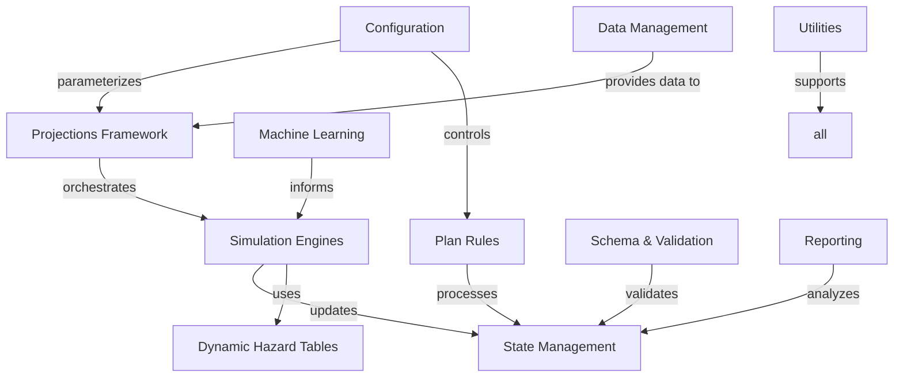

# Key Modules and Systems

This document provides an overview of the main modules and systems in the Workforce Simulation & Cost Model project.

## Core Architecture

### Configuration (`cost_model/config/`)
- **Config Loaders** (`loaders.py`): Load and parse YAML configuration files
- **Config Models** (`models.py`): Pydantic models for configuration validation
- **Config Accessors** (`accessors.py`): Helper functions to access specific config values
- **Plan Rules Config** (`plan_rules.py`): Retirement plan configuration
- **Parameter Management** (`params.py`): Runtime parameter handling

### Data Management (`cost_model/data/`)
- **Data Readers** (`readers.py`): Load data from various formats (Parquet, CSV)
- **Data Writers** (`writers.py`): Save data with format detection and optimization

### Simulation Engines (`cost_model/engines/`)
- **Termination Engine** (`term.py`): Handles employee exits and turnover with enhanced fallback logic
- **Hiring Engine** (`hire.py`): Generates and onboards new employees
- **Compensation Engine** (`comp.py`): Manages salary changes and merit increases
- **COLA Engine** (`cola.py`): Handles cost-of-living adjustments
- **Promotion Engine** (`promotion.py`): Manages role and level progression
- **Markov Promotion** (`markov_promotion.py`): Advanced promotion modeling
- **New Hire Termination** (`nh_termination.py`): Specialized new hire attrition

### Projections Framework (`cost_model/projections/`)
- **CLI Interface** (`cli.py`): Command-line interface for running simulations
- **Dynamic Hazard Tables** (`dynamic_hazard.py`): Runtime hazard table generation
- **Static Hazard Tables** (`hazard.py`): Pre-built hazard table loading
- **Snapshot Processing** (`snapshot.py`): Employee state snapshots
- **Event Logging** (`event_log.py`): Comprehensive event tracking
- **Reporting** (`reporting.py`): Output generation and analysis
- **Runner** (`runner.py`): Simulation orchestration

### State Management (`cost_model/state/`)
- **Schema Definitions** (`schema.py`): Column names and data structure constants
- **Age Calculations** (`age.py`): Employee age and age band management
- **Tenure Calculations** (`tenure.py`): Employee tenure and tenure band logic
- **Job Levels** (`job_levels.py`): Organizational hierarchy management
- **Snapshot Builder** (`builder.py`): Snapshot construction utilities
- **Snapshot Updates** (`snapshot_update.py`): State transition processing

### Plan Rules (`cost_model/plan_rules/`)
- **Auto Enrollment** (`auto_enrollment.py`): Automatic plan enrollment logic
- **Auto Increase** (`auto_increase.py`): Automatic contribution increases
- **Contribution Increase** (`contribution_increase.py`): Manual contribution adjustments
- **Eligibility** (`eligibility.py`): Plan participation eligibility rules
- **Eligibility Events** (`eligibility_events.py`): Eligibility change tracking
- **Enrollment** (`enrollment.py`): Plan enrollment processing
- **Contributions** (`contributions.py`): Contribution calculations
- **Proactive Decrease** (`proactive_decrease.py`): Contribution reduction logic

### Business Rules (`cost_model/rules/`)
- **Auto Enrollment Rules** (`auto_enrollment.py`): Core auto-enrollment logic
- **Auto Increase Rules** (`auto_increase.py`): Contribution escalation rules
- **Contribution Rules** (`contributions.py`): General contribution logic
- **Eligibility Rules** (`eligibility.py`): Participation eligibility
- **Rules Engine** (`engine.py`): Rule processing orchestration
- **Formula Parsers** (`formula_parsers.py`): Configuration formula parsing
- **Response Rules** (`response.py`): Behavioral response modeling
- **Validators** (`validators.py`): Rule validation utilities

### Dynamics (`cost_model/dynamics/`)
- **Dynamics Engine** (`engine.py`): Orchestrates population dynamics
- **Compensation Dynamics** (`compensation.py`): Salary progression modeling
- **Hiring Dynamics** (`hiring.py`): New hire generation logic
- **Termination Dynamics** (`termination.py`): Employee exit modeling
- **Sampling Utilities** (`sampling/`): Statistical sampling tools

### Machine Learning (`cost_model/ml/`)
- **Turnover Models** (`turnover.py`): Employee turnover prediction
- **ML Utilities** (`ml_utils.py`): Machine learning helper functions

### Schema & Validation (`cost_model/schema/`)
- **Column Definitions** (`columns.py`): Standardized column names
- **Data Types** (`dtypes.py`): Type definitions and validation
- **Event Schema** (`events.py`): Event structure definitions
- **Migration Tools** (`migration.py`): Schema migration utilities
- **Validation Rules** (`validation.py`): Data validation logic

### Reporting (`cost_model/reporting/`)
- **Metrics** (`metrics.py`): Key performance indicators and calculations

### Utilities (`cost_model/utils/`)
- **Column Schema** (`columns.py`): Column name constants and utilities
- **Constants** (`constants.py`): System-wide constants
- **Date Utilities** (`date_utils.py`): Date and time helper functions
- **Data Processing** (`data_processing.py`): General data manipulation
- **DataFrame Validation** (`dataframe_validator.py`): DataFrame quality checks
- **ID Generation** (`id_generation.py`): Unique identifier creation
- **Tenure Utilities** (`tenure_utils.py`): Tenure calculation helpers
- **Simulation Utilities** (`simulation_utils.py`): Simulation support functions
- **Census Generation** (`census_generation_helpers.py`): Test data generation
- **Compensation Utilities** (`compensation/`): Compensation calculation helpers

## Key System Features

### Enhanced Termination Engine
- **Intelligent Fallback Logic**: Handles missing hazard table combinations with multi-strategy approach
- **Age Sensitivity**: Applies age-based multipliers to termination rates
- **New Hire Termination**: Specialized handling for new employee attrition
- **Comprehensive Logging**: Detailed diagnostics for troubleshooting

### Dynamic Hazard Tables
- **Runtime Generation**: Creates hazard tables based on configuration parameters
- **Multi-Year Support**: Handles time-varying parameters across simulation years
- **Flexible Parameters**: Supports complex parameter structures and scenarios

### Auto-Tuning System
- **Parameter Optimization**: Automatically calibrates simulation parameters
- **Multi-Objective Scoring**: Balances headcount growth, age distribution, and compensation targets
- **Campaign Management**: Supports iterative tuning campaigns with result tracking

### Robust Data Processing
- **Format Detection**: Automatic Parquet/CSV format handling
- **Schema Validation**: Comprehensive data quality checks
- **Memory Optimization**: Efficient handling of large datasets
- **Error Recovery**: Graceful handling of data quality issues

## Module Relationships

## Recent Enhancements

### Termination Engine Improvements
- **Enhanced Fallback Logic**: Systematic handling of missing hazard table combinations
- **Multi-Strategy Approach**: Uses same-level, same-tenure, adjacent-level, and global fallbacks
- **Improved Diagnostics**: Detailed logging for missing combinations and fallback applications
- **Validation Integration**: Hazard table coverage validation against employee populations

### Auto-Tuning System
- **Production-Ready Calibration**: Automated parameter optimization for realistic simulations
- **Multi-Campaign Support**: Iterative refinement with campaign tracking and analysis
- **Evidence-Based Parameters**: Uses BLS/SSA data for realistic parameter ranges
- **Comprehensive Scoring**: Balances demographic preservation, headcount growth, and compensation targets

### Age Sensitivity Integration
- **Age-Based Multipliers**: Termination and promotion rates adjusted by employee age bands
- **Consistent Age Calculations**: Unified age calculation across simulation and projection modules
- **Retirement Modeling**: Enhanced modeling of age-related workforce transitions

## Related Documentation

- [Class Inventory](02_class_inventory.md) - Detailed list of all classes
- [Configuration Classes](03_config_classes.md) - Configuration module documentation
- [State Management](07_state_schema.md) - State tracking and schema details
- [Code Details](09_code_details_identified/index.md) - Implementation specifics and core components
