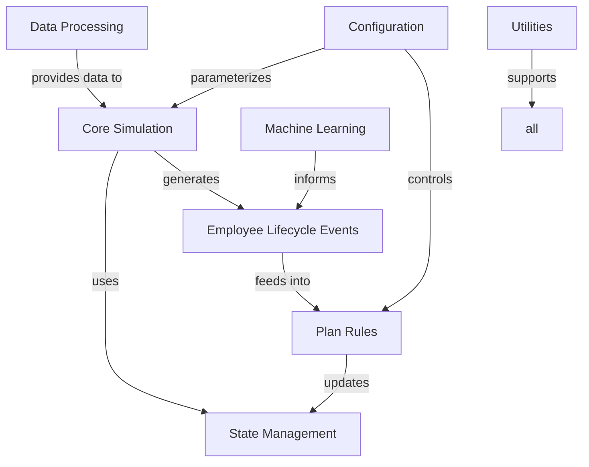

# Key Modules and Systems

This document provides an overview of the main modules and systems in the Workforce Simulation & Cost Model project.

## Core Simulation

- **Simulation Orchestrator**: Manages the overall simulation flow and coordinates between modules
- **Projection Engine**: Handles multi-year workforce projections
- **Dynamics Engine**: Manages year-to-year workforce changes and transitions

## State Management

- **Snapshot System**: Represents employee state at specific points in time
- **Event Logging**: Tracks all state changes for audit and analysis
- **Job Levels**: Manages organizational hierarchy and career progression

## Employee Lifecycle

- **Hiring System**: Generates and onboards new employees
- **Termination System**: Handles employee exits and turnover
- **Compensation System**: Manages salary changes and adjustments
- **Promotion System**: Handles role and level progression

## Plan Rules

- **Eligibility**: Determines plan participation eligibility
- **Enrollment**: Manages plan enrollment processes
- **Contributions**: Calculates employee and employer contributions
- **Vesting**: Tracks vesting schedules and calculations

## Data Processing

- **Data Readers/Writers**: Handles I/O operations for various data formats
- **Data Validation**: Ensures data quality and consistency
- **Sampling**: Provides statistical sampling utilities

## Machine Learning

- **Turnover Prediction**: Predicts employee turnover risk
- **Compensation Modeling**: Models salary growth and adjustments
- **Behavioral Simulation**: Simulates employee decisions and behaviors

## Configuration

- **Plan Configuration**: Defines retirement plan rules and parameters
- **Simulation Parameters**: Controls simulation behavior and scenarios
- **System Settings**: Application-level configuration

## Utilities

- **Logging**: Centralized logging system
- **Error Handling**: Standardized error types and handling
- **Helper Functions**: Common utility functions used throughout the codebase

## Module Relationships

## Related Documentation

- [Class Inventory](02_class_inventory.md) - Detailed list of all classes
- [Configuration Classes](03_config_classes.md) - Configuration module documentation
- [State Management](07_state_schema.md) - State tracking and schema details
