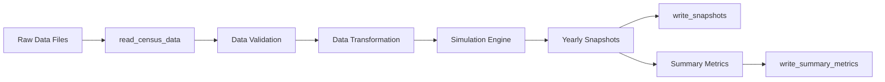

# Data Handling Classes

This document details the data handling classes and functions used throughout the Workforce Simulation & Cost Model system.

## Error Handling

### DataReadError

- **Location**: `cost_model.data.readers.DataReadError`
- **Description**: Custom exception raised when there's an error reading data files
- **Inherits from**: `Exception`
- **Key Attributes**:
  - `message`: Error message describing the issue
  - `file_path`: Path to the file being read (if applicable)
- **Usage Example**:
  ```python
  from cost_model.data.readers import read_census_data, DataReadError
  
  try:
      census_df = read_census_data("data/employees.parquet")
  except DataReadError as e:
      logger.error(f"Failed to read census data: {e}")
      raise
  ```

### DataWriteError

- **Location**: `cost_model.data.writers.DataWriteError`
- **Description**: Custom exception raised when there's an error writing data files
- **Inherits from**: `Exception`
- **Key Attributes**:
  - `message`: Error message describing the issue
  - `file_path`: Path to the file being written (if applicable)
- **Usage Example**:
  ```python
  from cost_model.data.writers import write_snapshots, DataWriteError
  
  try:
      write_snapshots(yearly_snapshots, output_dir="output")
  except DataWriteError as e:
      logger.error(f"Failed to write snapshots: {e}")
      raise
  ```

## Reader Functions

### read_census_data

- **Location**: `cost_model.data.readers.read_census_data`
- **Description**: Reads census data from CSV or Parquet files with automatic date parsing
- **Parameters**:
  - `file_path`: Path to the input file (CSV or Parquet)
- **Returns**: `pandas.DataFrame` containing the loaded census data
- **Features**:
  - Automatically detects file format by extension
  - Handles date parsing for common date columns
  - Validates required columns
  - Supports both CSV and Parquet formats
- **Usage Example**:
  ```python
  from pathlib import Path
  from cost_model.data.readers import read_census_data
  
  # Read from Parquet
  df = read_census_data(Path("data/employees.parquet"))
  
  # Read from CSV
  df = read_census_data(Path("data/employees.csv"))
  ```

## Writer Functions

### write_snapshots

- **Location**: `cost_model.data.writers.write_snapshots`
- **Description**: Writes yearly snapshot DataFrames to Parquet files
- **Parameters**:
  - `yearly_snapshots`: Dictionary mapping simulation years to DataFrames
  - `output_dir`: Directory to save the output files
  - `file_prefix`: Prefix for output filenames (default: "snapshot")
- **Features**:
  - Handles simulation year assignment
  - Removes unnecessary columns before saving
  - Creates output directory if it doesn't exist
  - Uses efficient Parquet format for storage
- **Usage Example**:
  ```python
  from pathlib import Path
  from cost_model.data.writers import write_snapshots
  
  # Assuming yearly_snapshots is a dict like {2023: df_2023, 2024: df_2024, ...}
  output_path = Path("output/snapshots")
  write_snapshots(yearly_snapshots, output_dir=output_path)
  ```

### write_summary_metrics

- **Location**: `cost_model.data.writers.write_summary_metrics`
- **Description**: Writes summary metrics to a CSV file
- **Parameters**:
  - `metrics_df`: DataFrame containing summary metrics
  - `output_dir`: Directory to save the output file
  - `file_prefix`: Prefix for output filename (default: "summary")
- **Features**:
  - Saves metrics in CSV format
  - Includes timestamp in filename by default
  - Creates output directory if needed
- **Usage Example**:
  ```python
  from cost_model.data.writers import write_summary_metrics
  
  # Assuming metrics_df is a DataFrame with summary metrics
  write_summary_metrics(metrics_df, output_dir="output/metrics")
  ```

## Data Processing Utilities

### Data Validation

- **Location**: Various validation functions throughout the codebase
- **Common Patterns**:
  - Type checking with `pandas.api.types`
  - Null/NA value detection
  - Range validation for numeric fields
  - Date consistency checks

### Data Transformation

Common data transformations include:
- Date parsing and formatting
- Categorical encoding
- Normalization of employee identifiers
- Calculation of derived fields (e.g., age, tenure)

## Data Flow



## Related Documentation

- [Configuration Classes](03_config_classes.md) - How data classes interact with configuration
- [State Management](07_state_schema.md) - How data is structured in the system state
- [API Reference](../api/data.md) - Complete API documentation for data handling functions
