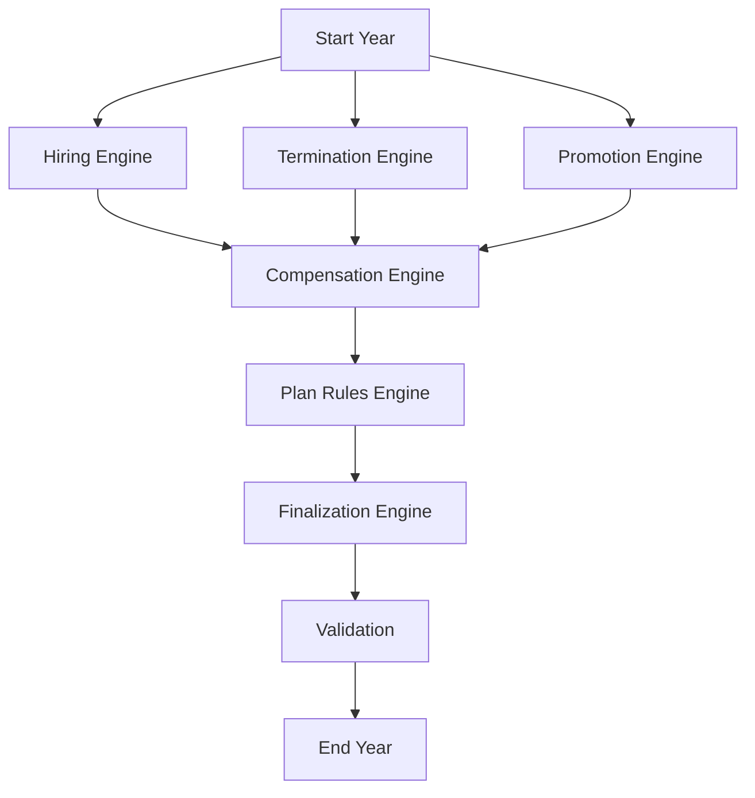
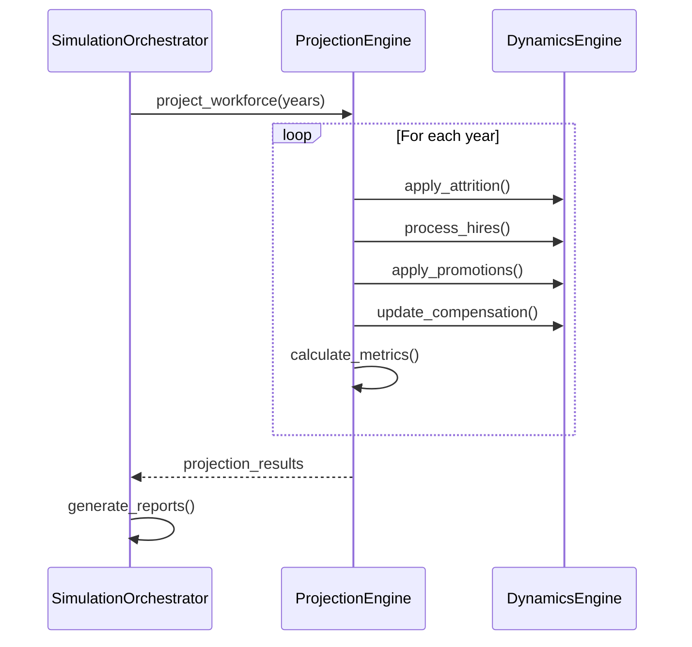

## Promotion Matrix Loading & Defaults

Promotion transitions are controlled by a Markov matrix loaded from the scenario config:

```yaml
# dev.yaml
promotion_matrix_path: ~    # null → use built-in default
# prod.yaml
promotion_matrix_path: config/promotion_matrix_prod.yaml
```

In Python, use:
```python
from cost_model.state.job_levels.sampling import load_markov_matrix
matrix = load_markov_matrix(path, allow_default=True)  # logs INFO to 'warnings_errors' logger if default is used
```
If the path is `None` and `allow_default=True`, a default 3x3 identity matrix is used and an INFO log is emitted (logger: 'warnings_errors'). If the file is missing or invalid, the system logs an error and exits.
# Dynamics & Engines

## Overview
This document details the core simulation engines and workforce dynamics components that drive the year-over-year projections in the cost modeling system.

## Run One Year Engine

### Purpose
The `run_one_year` engine orchestrates a complete simulation year, coordinating all workforce dynamics and plan rule applications. It serves as the main entry point for running annual projections.

### Key Components
- **Initialization**: Sets up the simulation year and validates inputs
- **Event Processing**: Handles various workforce events (hires, terms, promotions)
- **Compensation Updates**: Applies raises, COLAs, and other compensation changes
- **Plan Rules**: Processes retirement plan eligibility, enrollment, and contributions
- **Finalization**: Prepares outputs and updates the workforce snapshot

### Key Functions
- `run_one_year()`: Main orchestration function that runs a complete simulation year
- `_process_events()`: Handles event processing pipeline
- `_apply_compensation_changes()`: Manages all compensation updates
- `_apply_plan_rules()`: Processes retirement plan rules

### Configuration
```yaml
run_one_year:
  enable_validation: true
  log_level: INFO
  enable_profiling: false
```

## Compensation Engine

### Purpose
Manages all aspects of employee compensation including base salary, raises, and bonuses.

### Key Features
- Annual salary adjustments
- Promotion raises
- Merit increases
- Bonus calculations
- Compensation bands and structures
- COLA (Cost of Living Adjustments)

### Key Functions
- `update_salary()`: Applies COLA, promotion raises, and merit distributions
- `apply_comp_bump()`: Handles compensation increases with configurable parameters

### Configuration
```yaml
compensation:
  annual_raise_pct: 0.03
  promotion_raise_pct: 0.08
  bonus_pct: 0.10
  comp_bands:
    - level: 1
      min: 50000
      max: 70000
    - level: 2
      min: 65000
      max: 90000
```

## Hiring Engine

### Purpose
Manages the hiring process, including new employee creation and onboarding.

### Key Features
- New hire generation with unique IDs
- Compensation setting based on role and level
- Department/role assignment
- Onboarding process integration
- New hire termination rate application

### Key Functions
- `run()`: Main function to generate new hires
- `_generate_new_hire_ids()`: Creates unique employee IDs
- `_assign_compensation()`: Sets initial compensation

### Configuration
```yaml
hiring:
  annual_hiring_target: 50
  new_hire_comp_ratio: 0.85
  onboarding_period_days: 90
  role_distribution:
    engineering: 0.4
    product: 0.3
    sales: 0.2
    other: 0.1
```

## Termination Engine

### Purpose
Handles voluntary and involuntary employee terminations, including new hire attrition.

### Key Features
- Voluntary attrition modeling
- Performance-based terminations
- Retirement modeling
- New hire specific termination rates
- Prorated compensation calculations

### Key Functions
- `run()`: Processes terminations for experienced employees
- `run_new_hires()`: Handles new hire specific termination logic
- `_calculate_prorated_comp()`: Computes prorated compensation for mid-year terms

### Configuration
```yaml
termination:
  base_attrition_rate: 0.10
  new_hire_termination_rate: 0.15
  performance_impact: 0.3
  retirement_age: 65
  retirement_eligibility_years: 5
```

## Promotion Engine

### Purpose
Manages employee promotions and career progression using Markov chain modeling.

### Key Features
- Performance-based promotions
- Time-in-role requirements
- Promotion calibration
- Level-based raise percentages
- Exit probability modeling

### Key Functions
- `apply_markov_promotions()`: Main function for promotion logic
- `create_promotion_raise_events()`: Generates promotion and raise events
- `_calculate_promotion_probabilities()`: Determines promotion likelihoods

### Configuration
```yaml
promotion:
  min_years_in_role: 2
  promotion_raise_pct: 0.10
  promotion_rates:
    junior_to_mid: 0.20
    mid_to_senior: 0.15
    senior_to_lead: 0.10
  exit_rates:
    level_1: 0.05
    level_2: 0.03
    level_3: 0.02
```

## COLA Adjustments

### Purpose
Applies cost-of-living adjustments to employee compensation with configurable timing and jitter.

### Key Features
- Annual COLA application
- Configurable timing within year
- Employee-level jitter
- Vectorized calculations for performance

### Key Functions
- `cola()`: Applies COLA to active employees
- `_calculate_cola_amounts()`: Computes individual COLA amounts
- `_apply_jitter()`: Adds random variation to timing

### Configuration
```yaml
cola:
  annual_rate: 0.03
  apply_month: 1
  jitter_days: 30
  geographic_adjustments:
    high_cost: 1.15
    medium_cost: 1.0
    low_cost: 0.9
```

## Plan Rules Engine

### Purpose
Manages retirement plan rules and calculations, including eligibility and contributions.

### Key Features
- Eligibility determination based on service time
- Contribution calculations with IRS limits
- Employer matching logic
- Vesting schedules
- Auto-enrollment and auto-escalation

### Key Functions
- `calculate_eligibility()`: Determines employee eligibility
- `process_contributions()`: Handles employee and employer contributions
- `apply_vesting()`: Manages vesting schedules

### Configuration
```yaml
plan_rules:
  eligibility_months: 3
  employee_contribution_limit: 22500
  employer_match_pct: 0.05
  auto_enroll:
    enabled: true
    default_rate: 0.06
    escalation_rate: 0.01
  vesting_schedule:
    - years: 1
      pct: 0.20
    - years: 2
      pct: 0.40
    - years: 3
      pct: 0.60
    - years: 4
      pct: 0.80
    - years: 5
      pct: 1.00
```

## Finalization Engine

### Purpose
Handles end-of-year processing and prepares data for the next simulation year.

### Key Features
- Data validation and integrity checks
- Snapshot updates for next period
- Reporting metrics calculation
- Cleanup of temporary data

### Key Functions
- `finalize_year()`: Orchestrates year-end processing
- `validate_results()`: Ensures data consistency
- `prepare_reports()`: Generates summary metrics

### Configuration
```yaml
finalization:
  enable_validation: true
  generate_reports: true
  archive_data: true
  report_types:
    - headcount
    - compensation
    - plan_participation
```

## Validation System

### Purpose
Ensures data integrity and business rule compliance throughout the simulation.

### Key Features
- Schema validation for all data structures
- Business rule enforcement
- Data quality checks
- Simulation state validation

### Key Functions
- `validate_snapshot()`: Verifies snapshot integrity
- `check_business_rules()`: Enforces business constraints
- `log_validation_errors()`: Reports issues

### Configuration
```yaml
validation:
  enable_realtime: true
  strict_mode: false
  log_level: WARNING
  checks:
    - type: schema
      level: error
    - type: business_rules
      level: warning
    - type: data_quality
      level: info
```

## Event Processing System

### Purpose
Manages the lifecycle of all simulation events with consistent handling and logging.

### Key Features
- Event creation and validation
- Timestamp management
- Event chaining and dependencies
- Audit logging

### Event Types
- `EVT_HIRE`: Employee hiring
- `EVT_TERM`: Employee termination
- `EVT_PROMOTION`: Job level increase
- `EVT_RAISE`: Compensation increase
- `EVT_COLA`: Cost of living adjustment
- `EVT_CONTRIB`: Retirement plan contribution

### Configuration
```yaml
event_processing:
  max_events_per_cycle: 10000
  retention_days: 365
  log_level: INFO
  enable_audit_log: true
```

## Integration Points



## Key Implementation Details

1. **Modular Design**: Each engine component is designed to be independently testable and maintainable
2. **Event-Driven Architecture**: Components communicate through well-defined events and state changes
3. **Extensible Framework**: New engines can be added without modifying core components
4. **Data Validation**: Comprehensive validation at each processing stage
5. **Performance Optimized**: Efficient processing for large employee populations

## Employee Lifecycle

### EmployeeLifecycle

- **Location**: `dynamics.lifecycle.EmployeeLifecycle`
- **Description**: Manages employee state transitions
- **Key Methods**:
  - `onboard_employee(employee_data)`: Handles new hire onboarding
  - `process_termination(employee_id, termination_date)`: Handles employee exits
  - `process_promotion(employee_id, new_level)`: Handles promotions
  - `update_tenure(current_date)`: Updates tenure for all employees

## Compensation Management

### CompensationModel

- **Location**: `dynamics.compensation.CompensationModel`
- **Description**: Handles compensation changes and adjustments
- **Key Methods**:
  - `apply_merit_increases(effective_date)`: Applies annual merit increases
  - `apply_promotion_increase(employee_id, new_level)`: Handles promotion raises
  - `calculate_bonus(employee_id, performance_rating)`: Calculates bonus amounts

## Simulation Flow



## Related Documentation

- [Class Inventory](02_class_inventory.md) - Complete list of all classes
- [Configuration Classes](03_config_classes.md) - How simulation parameters are configured
- [State Management](07_state_schema.md) - How simulation state is tracked
