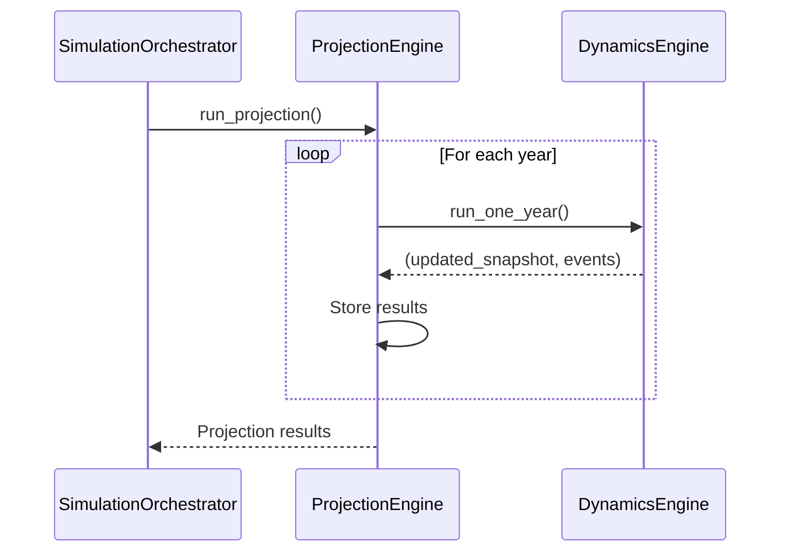

# Run One Year Engine

## Purpose
The `run_one_year` engine orchestrates a complete simulation year, coordinating all workforce dynamics and plan rule applications.

## Key Components
- **Initialization**: Sets up the simulation year and validates inputs
- **Event Processing**: Handles various workforce events (hires, terms, promotions)
- **Compensation Updates**: Applies raises, COLAs, and other compensation changes
- **Plan Rules**: Processes retirement plan eligibility, enrollment, and contributions
- **Finalization**: Prepares outputs and updates the workforce snapshot

## Key Functions

### run_one_year()
- **Location**: `cost_model.engines.run_one_year.run_one_year`
- **Description**: Main orchestration function that runs a complete simulation year
- **Parameters**:
  - `snapshot`: Current workforce snapshot
  - `config`: Simulation configuration
  - `current_year`: Year being simulated
- **Returns**: Updated snapshot and event log
- **Search Tags**: `function:run_one_year`, `engine:core`

### _process_events()
- **Location**: `cost_model.engines.run_one_year._process_events`
- **Description**: Handles event processing pipeline
- **Search Tags**: `function:_process_events`, `engine:events`

### _apply_compensation_changes()
- **Location**: `cost_model.engines.run_one_year._apply_compensation_changes`
- **Description**: Manages all compensation updates
- **Search Tags**: `function:_apply_compensation_changes`, `engine:compensation`

## Configuration

```yaml
run_one_year:
  enable_validation: true
  log_level: INFO
  enable_profiling: false
```

## Sequence Diagram


