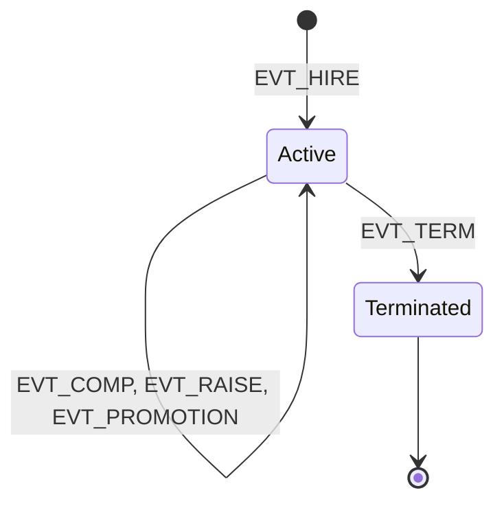
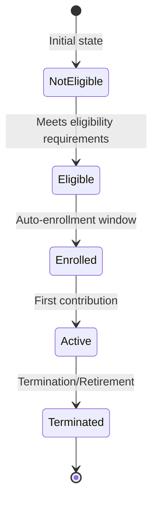

# State Management & Schema

This document details the state management system and data schema used in the Workforce Simulation & Cost Model.

## Core State Components

### Employee Snapshot

- **Location**: `state.snapshot`
- **Description**: Represents the state of all employees at a specific point in time
- **Key Attributes**:
  - `employee_id`: Unique employee identifier (string)
  - `employee_hire_date`: Date employee was hired
  - `employee_birth_date`: Employee's date of birth
  - `employee_gross_compensation`: Annual compensation
  - `employee_termination_date`: Date employee was terminated (if applicable)
  - `active`: Boolean indicating if employee is currently active
  - `employee_deferral_rate`: Current retirement plan deferral rate
  - `employee_tenure`: Years of service (float)
  - `employee_tenure_band`: Categorical tenure band (e.g., "0-1", "1-3", "3-5", "5+")
  - `employee_level`: Job level/grade
  - `job_level_source`: Source of job level assignment ("hire", "promotion", "demotion", "manual")
  - `exited`: Boolean indicating if employee has exited the company
  - `simulation_year`: Current simulation year

### Event Log

- **Location**: `state.event_log`
- **Description**: Tracks all state changes for audit and analysis
- **Key Event Types**:
  - `EVT_HIRE`: Employee hire event
  - `EVT_TERM`: Employee termination
  - `EVT_COMP`: Compensation change
  - `EVT_COLA`: Cost of living adjustment
  - `EVT_PROMOTION`: Job level change
  - `EVT_RAISE`: Merit increase
  - `EVT_CONTRIB`: Retirement plan contribution
  - `EVT_NEW_HIRE_TERM`: New hire termination

### Job Levels

- **Location**: `state.job_levels`
- **Description**: Defines job levels and compensation ranges
- **Key Attributes**:
  - `level_id`: Unique level identifier (integer)
  - `name`: Human-readable name
  - `min_compensation`, `max_compensation`: Salary range
  - `mid_compensation`: Target midpoint compensation
  - `target_comp_ratio`: Target compensation ratio
  - `job_families`: List of associated job families

## Schema Definitions

### Event Schema

| Column | Type | Nullable | Description |
|--------|------|----------|-------------|
| event_id | string | No | Unique event identifier (UUID) |
| event_time | timestamp[ns] | No | When the event occurred |
| employee_id | string | No | Employee identifier |
| event_type | string | No | Type of event (e.g., EVT_HIRE, EVT_TERM) |
| value_num | float64 | Yes | Numeric value associated with the event |
| value_json | string | Yes | JSON-encoded data for complex values |
| meta | string | Yes | Additional metadata |

### Snapshot Schema

| Column | Type | Nullable | Description |
|--------|------|----------|-------------|
| employee_id | string | No | Unique employee identifier |
| employee_hire_date | datetime64[ns] | Yes | Date employee was hired |
| employee_birth_date | datetime64[ns] | Yes | Employee's date of birth |
| employee_gross_compensation | float64 | Yes | Annual compensation |
| employee_termination_date | datetime64[ns] | Yes | Termination date if applicable |
| active | boolean | Yes | Is employee currently active |
| employee_deferral_rate | float64 | Yes | Current deferral rate |
| employee_tenure | float64 | Yes | Years of service |
| employee_tenure_band | string | Yes | Categorical tenure band |
| employee_level | Int64 | Yes | Job level/grade |
| job_level_source | category | Yes | Source of job level |
| exited | boolean | Yes | Has employee exited |
| simulation_year | Int64 | Yes | Current simulation year |

## State Transitions

### Employee Lifecycle

### Plan Participation

## Related Documentation

- [Job Levels & Promotions](job_levels.md) - Job level definitions and promotion logic
- [Class Inventory](02_class_inventory.md) - Complete list of all classes
- [Configuration Classes](03_config_classes.md) - How state schemas are configured
- [Dynamics & Engines](../05_dynamics_engines.md) - How state is updated during simulation
- [Machine Learning & Plan Rules](../06_ml_plan_rules.md) - How ML and business rules interact with state
